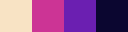

# Gameboy Camera filter, *working title*

A simple python script to turn your images into gameboy camera like images.

## Features:

Reads most types of images through opencv

- Supports custom rescaling for maximum pixelation
- Default game boy camera pallete as well as some other fancy ones
- Allows to input four colours to use as custom pallete


## Dependencies:

- Python 3
- Opencv
- Numpy
- Matplotlib


## Running:

- To convert an image to the typical format just use:

  ````shell
   python gbc.py -i <your_image> -s <scaling_factor> -p 1 -o <output_image>
  ````

  

  This selects the first palette which is the standard  gameboy camera photo style, however there are some other neat palettes included from people with more taste than me

  - Palette 1 is [NOSTALGIA PALETTE](https://lospec.com/palette-list/nostalgia)by [WildLeoKnight](https://lospec.com/wildleoknight)  
  - Palette 2 is [SPACEHAZE PALETTE](https://lospec.com/palette-list/spacehaze) by [WildLeoKnight](https://lospec.com/wildleoknight)  
  - Palette 3 is [ICE CREAM GB PALETTE](https://lospec.com/palette-list/ice-cream-gb) by [Kerrie Lake](https://lospec.com/kerrielake)  
  - Palette 4 is [WISH GB PALETTE](https://lospec.com/palette-list/wish-gb) by [Kerrie Lake](https://lospec.com/kerrielake)  
  - Palette 5 is [AYY4 PALETTE](https://lospec.com/palette-list/ayy4) by [Polyducks](https://lospec.com/polyducks)

  Go check their work!

- If you wish to input your own pallete you can by using

  ``````
  python gbc.py -i <your_image> -s <scaling_factor> -o <output_image> -c <hex0> <hex1> <hex2> <hex3>
  ``````

  Where each value called hex is a hex colour value **without #**. The order should be **from lighter colour to darker** colour to get the best looks.

  ​	

## Examples:


|               Original image (Wikipedia)                |
| :-----------------------------------------------------: |
|  |


|            Palette 0, standard game boy look            |                  Palette 3 - Nostalgia                  |
| :-----------------------------------------------------: | :-----------------------------------------------------: |
|  |  |


|                   Palette 2 - Spacehaze                    |                   Palette 3 - ice cream                    |
| :--------------------------------------------------------: | :--------------------------------------------------------: |
|  |  |


|                     Palette 4 - Wish                      |                     Palette 4 - Ayy4                     |
| :-------------------------------------------------------: | :------------------------------------------------------: |
|  |  |


